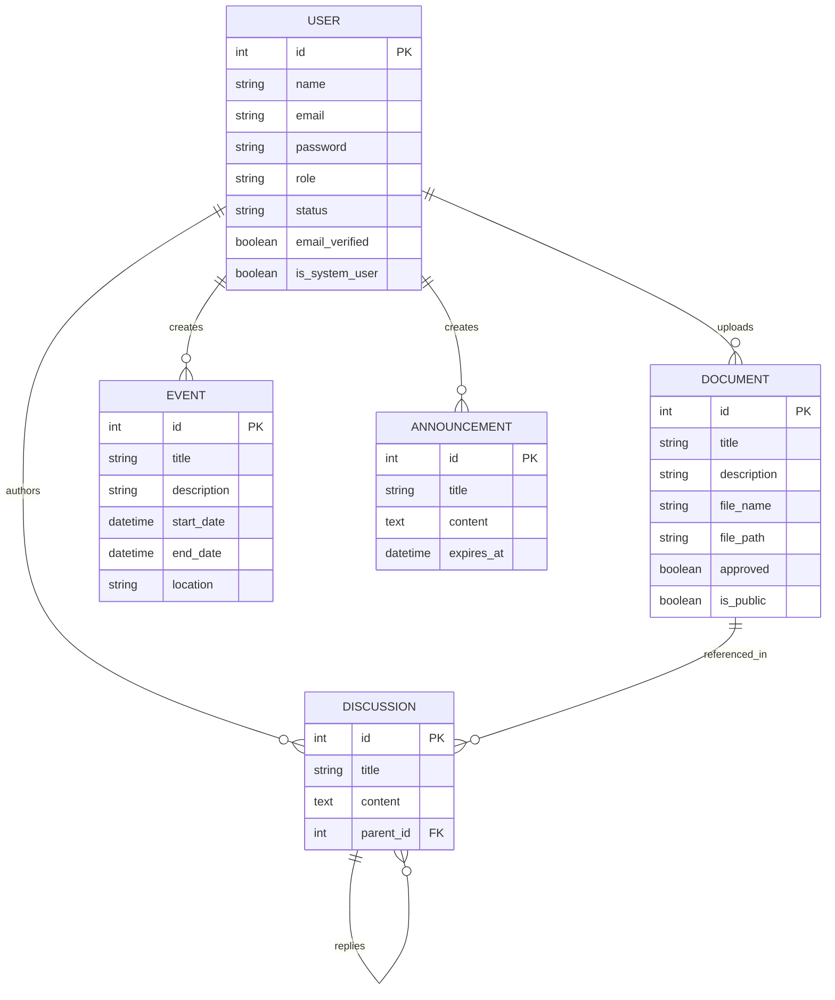
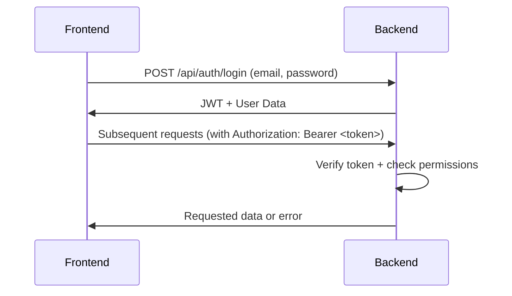

# Backend System Analysis for Frontend Integration

## 1. API Surface Summary

### Authentication
| Endpoint | Method | Description |
|----------|--------|-------------|
| `/api/auth/register` | POST | Register new user (status: pending) |
| `/api/auth/login` | POST | Authenticate user, return JWT |
| `/api/auth/forgot-password` | POST | Initiate password reset |
| `/api/auth/verify-reset-token` | GET | Validate password reset token |
| `/api/auth/reset-password` | POST | Complete password reset |

### User Profile
| Endpoint | Method | Description |
|----------|--------|-------------|
| `/api/users/me` | GET | Get authenticated user's profile |
| `/api/users/me` | PUT | Update user's profile |
| `/api/users/me/password` | PUT | Change user's password |

### Admin Management
| Endpoint | Method | Description |
|----------|--------|-------------|
| `/api/admin/users` | GET | List all non-system users |
| `/api/admin/users/{id}` | GET | Get user details by ID |
| `/api/admin/users/{id}/status` | PUT | Update user status |
| `/api/admin/users/{id}/role` | PUT | Update user role |
| `/api/admin/users/{id}/password` | PUT | Change user's password (admin) |
| `/api/admin/users/{id}` | DELETE | Delete user and associated data |

### Content Modules
*(Refer to phase.md for full endpoint details)*
- Announcements: CRUD operations
- Events: CRUD operations
- Documents: Upload/download with approval flow
- Discussions: Thread/reply management

## 2. Core Data Models

## 3. Auth Mechanism

### JWT Flow

### Role-Based Access
| Role | Permissions |
|------|-------------|
| Member | View content, Manage own profile, Post discussions |
| Admin | Full user management, Content moderation, System configuration |

## 4. Key Dependencies
- **Runtime**: Node.js
- **Framework**: Express
- **Database**: SQLite via Sequelize ORM
- **Auth**: jsonwebtoken, bcrypt
- **Validation**: Joi, express-validator
- **File Handling**: multer
- **Security**: dompurify, jsdom

## 5. Integration Risks
1. **File Uploads**: 
   - Requires multipart/form-data handling
   - Large file support not implemented
   - Virus scanning not included

2. **Error Handling**:
   - Mixed error response formats (some Swagger-standard, some custom)
   - Needs consistent frontend error parsing

3. **Security**:
   - JWT storage/refresh strategy needed
   - Content sanitization for rich text fields

4. **Pagination**:
   - Inconsistent pagination parameters across endpoints
   - Frontend must handle varying response structures

5. **State Management**:
   - Pending user status requires special handling
   - Admin approval flows need UI representation