# Board Governance Schema - Entity Relationship Diagram

## Database Schema (Visual Reference)

### Canonical ERD (Mermaid)

The authoritative Entity Relationship Diagram is maintained in Mermaid format and includes all current and planned entities for the board governance module:

**Source:** [`../diagrams/board-data-erd.mmd`](../diagrams/board-data-erd.mmd)
**Visual:** [`../diagrams/board-data-erd.svg`](../diagrams/board-data-erd.svg)



#### Update Cadence

The ERD should be regenerated whenever database migrations are added or modified:

1. Edit the Mermaid source: `docs/diagrams/board-data-erd.mmd`
2. Regenerate the SVG:
   ```bash
   cd docs/diagrams
   mmdc -i board-data-erd.mmd -o board-data-erd.svg -t neutral -b transparent --puppeteerConfigFile <(echo '{"args":["--no-sandbox","--disable-setuid-sandbox"]}')
   ```
3. Verify entity names, column names, and foreign key relationships match the migration files
4. Commit both `.mmd` and `.svg` files together

**Note:** The Puppeteer `--no-sandbox` flags are required for Ubuntu 23.10+ due to AppArmor restrictions.

### Text-Based Schema (Legacy Reference)

```
┌─────────────────────────┐
│     board_titles        │
├─────────────────────────┤
│ PK  id (INTEGER)        │
│     title (STRING) UQ   │
│     rank (INTEGER)      │
│     created_at (DATE)   │
│     updated_at (DATE)   │
└───────────┬─────────────┘
            │
            │ 1:N (RESTRICT on delete)
            │
            ▼
┌─────────────────────────┐         ┌─────────────────────────┐
│    board_members        │         │        users            │
├─────────────────────────┤         ├─────────────────────────┤
│ PK  id (INTEGER)        │         │ PK  id (INTEGER)        │
│ FK  user_id ────────────┼────────>│     name (STRING)       │
│ FK  title_id            │  N:1    │     email (STRING)      │
│     start_date (DATE)   │ CASCADE │     role (STRING)       │
│     end_date (DATE)     │         │     ... (other fields)  │
│     bio (TEXT)          │         └─────────────────────────┘
│     created_at (DATE)   │
│     updated_at (DATE)   │
└─────────────────────────┘


┌─────────────────────────────────────────────────────────────┐
│                      Config Table                            │
├─────────────────────────────────────────────────────────────┤
│ PK  key (STRING)              │ value (TEXT)                │
├───────────────────────────────┼─────────────────────────────┤
│ board.visibility              │ public                      │
│ board.history-visibility      │ members_only                │
└─────────────────────────────────────────────────────────────┘
```

---

## Indexes

### board_titles
- **Primary Key:** `id`
- **Unique Constraint:** `title` (auto-index: `sqlite_autoindex_board_titles_1`)
- **Index:** `idx_board_titles_rank` on `rank`

### board_members
- **Primary Key:** `id`
- **Composite Index:** `idx_board_members_title_start` on (`title_id`, `start_date`)
  - Purpose: Sort current members by title rank
- **Composite Index:** `idx_board_members_user_end` on (`user_id`, `end_date`)
  - Purpose: Query user's position history
- **Single Index:** `idx_board_members_end_date` on `end_date`
  - Purpose: Efficiently query current members (WHERE end_date IS NULL)

---

## Foreign Key Constraints

### board_members → users
- **Column:** `user_id`
- **References:** `users.id`
- **On Update:** CASCADE (if user ID changes, update board_members)
- **On Delete:** CASCADE (if user deleted, remove their board history)

### board_members → board_titles
- **Column:** `title_id`
- **References:** `board_titles.id`
- **On Update:** CASCADE (if title ID changes, update board_members)
- **On Delete:** RESTRICT (cannot delete title if board members reference it)

---

## Data Flow

### Seeded Data

#### board_titles (Static Roles)
```
┌────┬─────────────────────────┬──────┐
│ id │ title                   │ rank │
├────┼─────────────────────────┼──────┤
│  1 │ President               │  1   │
│  2 │ Vice President          │  2   │
│  3 │ Secretary               │  3   │
│  4 │ Treasurer               │  4   │
│  5 │ Board Member at Large   │  5   │
└────┴─────────────────────────┴──────┘
```

#### Config Flags
```
┌───────────────────────────┬───────────────┐
│ key                       │ value         │
├───────────────────────────┼───────────────┤
│ board.visibility          │ public        │
│ board.history-visibility  │ members_only  │
└───────────────────────────┴───────────────┘
```

### Sample board_members Data (Future)
```
┌────┬─────────┬──────────┬────────────┬──────────┬────────┐
│ id │ user_id │ title_id │ start_date │ end_date │ bio    │
├────┼─────────┼──────────┼────────────┼──────────┼────────┤
│  1 │     42  │    1     │ 2024-01-01 │ NULL     │ "..."  │ ← Current President
│  2 │     13  │    2     │ 2024-01-01 │ NULL     │ "..."  │ ← Current VP
│  3 │     27  │    1     │ 2022-01-01 │ 2023-12-31│ "..." │ ← Former President
└────┴─────────┴──────────┴────────────┴──────────┴────────┘
```

---

## Query Examples

### Get Current Board Roster (Ordered by Rank)
```sql
SELECT
  u.name,
  u.email,
  bt.title,
  bt.rank,
  bm.start_date,
  bm.bio
FROM board_members bm
JOIN board_titles bt ON bm.title_id = bt.id
JOIN users u ON bm.user_id = u.id
WHERE bm.end_date IS NULL
ORDER BY bt.rank;
```

### Get Historical Board Members
```sql
SELECT
  u.name,
  bt.title,
  bm.start_date,
  bm.end_date
FROM board_members bm
JOIN board_titles bt ON bm.title_id = bt.id
JOIN users u ON bm.user_id = u.id
WHERE bm.end_date IS NOT NULL
ORDER BY bm.start_date DESC;
```

### Get User's Board History
```sql
SELECT
  bt.title,
  bm.start_date,
  bm.end_date,
  CASE WHEN bm.end_date IS NULL THEN 'Current' ELSE 'Past' END as status
FROM board_members bm
JOIN board_titles bt ON bm.title_id = bt.id
WHERE bm.user_id = ?
ORDER BY bm.start_date DESC;
```

### Check Board Visibility Setting
```sql
SELECT value FROM config WHERE key = 'board.visibility';
-- Returns: 'public' or 'members_only'
```

---

## Relationships Summary

- **board_titles** (1) → (N) **board_members**: One title can have many members over time
- **users** (1) → (N) **board_members**: One user can hold multiple positions over time
- **board_members**: Tracks both current (end_date IS NULL) and historical assignments
- **config**: Feature flags control visibility behavior at runtime

---

**Schema Version:** 1.0 (Task I1.T1)
**Created:** 2025-11-23
**Database:** SQLite 3.x
**ORM:** Sequelize 6.37.7
